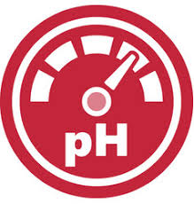
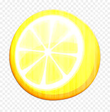
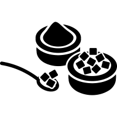
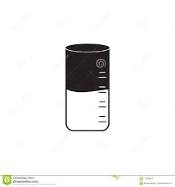
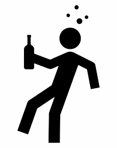
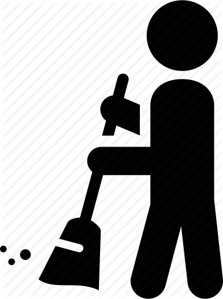
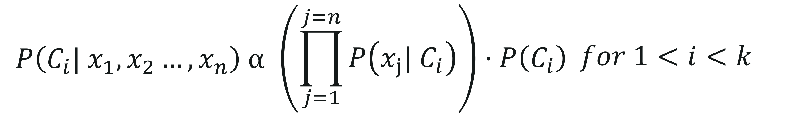

# final_project

##Visit our final website at https://master.dxyc7zu9259ce.amplifyapp.com/

# WILL YOUR WINE  
BE GOOD, POOR

Using the attributes of wine to predict the quality it will produce

Winemakers use pH as a way to measure ripeness in relation to acidity. Low pH wines will taste tart and crisp, while higher pH wines are more susceptible to bacterial growth.

Citric acid is most commonly used as an acid supplement during the fermentation process to help winemakers boost the acidity of their wine especially grapes grown in warmer climates. It can also be used as a stabilizer to prevent ferric hazes.

The level of Chloride and sodium ions in wines essentially depends on the geographic, geologic and climatic conditions of vine culture. As a general rule, the levels of these ions are low.

Sulfites in wine are chemicals used as preservatives to prevent browning and discoloration in foods and drinks. For wine making, sulfites, also known as sulphites, have been used for centuries.

Residual Sugar (or RS) is from natural grape sugars leftover in a wine after the alcoholic fermentation finishes. A dry wine will have the least amount of RS, while a sweet wine will have the most.

Density is defined as the mass, or weight, per volume of a wine. The density of wine is primarily determined by the concentration of alcohol, sugar, glycerol, and other dissolved solids.

Our last attribute is alcohol level. I assume this one needs no explanation.

div class="col-lg-4">

#### INITIAL CLEANING OF THE DATA

The first thing we needed to do was clean the data- we removed any correlated values. The correlation table in our data breakdown below will summarize what we found.

#### SECONDARY CLEANING OF THE DATA

We then removed all of the null values to make sure we had a valid data set. As it turns out, there weren't any, so we were able to use all the data entries in our data set.

#### CLASSIFICATION

We added a conditional to the quality of the wine to define it as good or bad. The initial data set had a rating of 3-8 to quantify the quality of the wine- we redefined that classification in order to improve the accuracy of our results.

#### OUTLIERS

We looked at the outliers in the data to make sure they wouldn't taint the results. The data breakdown includes a chart summarizing what we found.

#### SCALING

We used the scaling function to make sure the model would be able to successfully interpret the data. The code we used for this is included in the analysis page - the link is below.

#### CHOOSING THE FEATURES

8 of the features accounted for 90% of the variation- but ultimately, we decided to include all features in our model in order to get the most accurate outcome. For more details, check out the data on our [ANALYSIS PAGE.]({{ url_for('privacy_policy') }}).

#### WHAT IS LOGIGISTIC REGRESSION

Logistic regression is the appropriate regression analysis to conduct when the dependent variable is dichotomous (binary). Like all regression analyses, the logistic regression is a predictive analysis. Logistic regression is used to describe data and to explain the relationship between one dependent binary variable and one or more nominal, ordinal, interval or ratio-level independent variables.

#### WHY WE RAN THIS MODEL

We wanted to predict if a given set of variables would result in a good or a bad wine - a binary result. With the data we had available, it seemed like - if you will forgive the pun- a logical choice.

#### RUNNING THE MODEL

We used 75% of the data to train the model, and 25% to test. The result was a 76% accuracy.

#### LIMITATIONS OF THIS ANALYSIS

Since it is a binary analysis, we had to limit our findings to 2- good wine or bad. Since this had the better accuracy, we decided in the end to use this model. Ideally, we would have liked to have returned a more refined result.

#### NAIVE BAYES

A Naive Bayes classifier is a probabilistic machine learning model that’s used for classification task. The crux of the classifier is based on the Bayes theorem. Using Bayes theorem, we can find the probability of A happening, given that B has occurred. Here, B is the evidence and A is the hypothesis. The assumption made here is that the predictors/features are independent. That is presence of one particular feature does not affect the other. Hence it is called naive.

#### WHY WE RAN THIS MODEL

The naive-bayes model can return an array of results based on the data given- meaning we could classify the quality of the wines in more categories than the logistic regression. We looked at returning results that were more specific- excellent, above average, fair, below average, poor. Ultimately, the model proved a bit less accurate, so we went with the logistic regression.

#### RUNNING THE MODEL

We used 75% of the data to train the model, and 25% to test. The result was a 74% accuracy.

#### LIMITATIONS OF THIS ANALYSIS

With the data we gave the model, the logistic regression proved to be more accurate in it's results. We were forced to choose between higher accuracy versus higher diversification. We chose accuracy.

