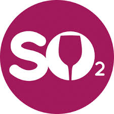

# final_project

##Visit our final website at https://master.dxyc7zu9259ce.amplifyapp.com/

# WILL YOUR WINE  
BE GOOD, POOR

Using the attributes of wine to predict the quality it will produce

Winemakers use pH as a way to measure ripeness in relation to acidity. Low pH wines will taste tart and crisp, while higher pH wines are more susceptible to bacterial growth.

Citric acid is most commonly used as an acid supplement during the fermentation process to help winemakers boost the acidity of their wine especially grapes grown in warmer climates. It can also be used as a stabilizer to prevent ferric hazes.

The level of Chloride and sodium ions in wines essentially depends on the geographic, geologic and climatic conditions of vine culture. As a general rule, the levels of these ions are low.

Sulfites in wine are chemicals used as preservatives to prevent browning and discoloration in foods and drinks. For wine making, sulfites, also known as sulphites, have been used for centuries.

Residual Sugar (or RS) is from natural grape sugars leftover in a wine after the alcoholic fermentation finishes. A dry wine will have the least amount of RS, while a sweet wine will have the most.

Density is defined as the mass, or weight, per volume of a wine. The density of wine is primarily determined by the concentration of alcohol, sugar, glycerol, and other dissolved solids.

Our last attribute is alcohol level. I assume this one needs no explanation.

div class="col-lg-4">

#### INITIAL CLEANING OF THE DATA

The first thing we needed to do was clean the data- we removed any correlated values. The correlation table in our data breakdown below will summarize what we found.

#### SECONDARY CLEANING OF THE DATA

We then removed all of the null values to make sure we had a valid data set. As it turns out, there weren't any, so we were able to use all the data entries in our data set.

#### CLASSIFICATION

We added a conditional to the quality of the wine to define it as good or bad. The initial data set had a rating of 3-8 to quantify the quality of the wine- we redefined that classification in order to improve the accuracy of our results.

#### OUTLIERS

We looked at the outliers in the data to make sure they wouldn't taint the results. The data breakdown includes a chart summarizing what we found.

#### SCALING

We used the scaling function to make sure the model would be able to successfully interpret the data. The code we used for this is included in the analysis page - the link is below.

#### CHOOSING THE FEATURES

8 of the features accounted for 90% of the variation- but ultimately, we decided to include all features in our model in order to get the most accurate outcome. For more details, check out the data on our [ANALYSIS PAGE.]({{ url_for('privacy_policy') }}).

#### WHAT IS LOGIGISTIC REGRESSION

Logistic regression is the appropriate regression analysis to conduct when the dependent variable is dichotomous (binary). Like all regression analyses, the logistic regression is a predictive analysis. Logistic regression is used to describe data and to explain the relationship between one dependent binary variable and one or more nominal, ordinal, interval or ratio-level independent variables.

#### WHY WE RAN THIS MODEL

We wanted to predict if a given set of variables would result in a good or a bad wine - a binary result. With the data we had available, it seemed like - if you will forgive the pun- a logical choice.

#### RUNNING THE MODEL

We used 75% of the data to train the model, and 25% to test. The result was a 76% accuracy.

#### LIMITATIONS OF THIS ANALYSIS

Since it is a binary analysis, we had to limit our findings to 2- good wine or bad. Since this had the better accuracy, we decided in the end to use this model. Ideally, we would have liked to have returned a more refined result.

#### NAIVE BAYES

A Naive Bayes classifier is a probabilistic machine learning model that’s used for classification task. The crux of the classifier is based on the Bayes theorem. Using Bayes theorem, we can find the probability of A happening, given that B has occurred. Here, B is the evidence and A is the hypothesis. The assumption made here is that the predictors/features are independent. That is presence of one particular feature does not affect the other. Hence it is called naive.

#### WHY WE RAN THIS MODEL

The naive-bayes model can return an array of results based on the data given- meaning we could classify the quality of the wines in more categories than the logistic regression. We looked at returning results that were more specific- excellent, above average, fair, below average, poor. Ultimately, the model proved a bit less accurate, so we went with the logistic regression.

#### RUNNING THE MODEL

We used 75% of the data to train the model, and 25% to test. The result was a 74% accuracy.

#### LIMITATIONS OF THIS ANALYSIS

With the data we gave the model, the logistic regression proved to be more accurate in it's results. We were forced to choose between higher accuracy versus higher diversification. We chose accuracy.

### The Madness to our Methods

### Walk-through of our coding

To begin, we had to look at the data to see what we could learn about it. Unless you are a winemaker, the features in this data set are sanskrit.

After an extended Google session, we had an understanding of what these values mean. The first scroll pane is the fruits of our research:

1.  ph - Winemakers use pH as a way to measure ripeness in relation to acidity. Low pH wines will taste tart and crisp, while higher pH wines are more susceptible to bacterial growth.
2.  Citric Acid - Citric acid is most commonly used as an acid supplement during the fermentation process to help winemakers boost the acidity of their wine especially grapes grown in warmer climates. It can also be used as a stabilizer to prevent ferric hazes.
3.  Chlorides - The level of Chloride and sodium ions in wines essentially depends on the geographic, geologic and climatic conditions of vine culture. As a general rule, the levels of these ions are low
4.  Sulphates - Sulfites in wine are chemicals used as preservatives to prevent browning and discoloration in foods and drinks. For wine making, sulfites, also known as sulphates, have been used for centuries.
5.  Residual Sugar - Residual Sugar (or RS) is from natural grape sugars leftover in a wine after the alcoholic fermentation finishes. A dry wine will have the least amount of RS, while a sweet wine will have the most.
6.  Density - Density is defined as the mass, or weight, per volume of a wine. The density of wine is primarily determined by the concentration of alcohol, sugar, glycerol, and other dissolved solids.
7.  Alcohol Level - Our last attribute is alcohol level. I assume this one needs no explanation.

Now that we know what the data means, we can begin to build our prediction model.

We can see that we have 1599 lines of data, with 12 columns.

Next we look at null values or missing data. In this case, the data is already perfectly cleaned.

We also know that all the values are floats, so we don't have to cast any data from strings.

 

This is a plot that shows the distribution of the features we used compared to the quality of the wine.

We used this information to decide which features we wanted to look at.

Quality has most values concentrated in the categories of 5,6,7

A look at the description of the data.

As the prior 2 charts chow, in order for the model to run correctly, we definitely needed to use a scaling function.

The size and range of the different variable is too varied to give a meaningful result.

We created a correlation matrix to show which values are related to each other.

This doesn't really show anything useful, since it looks like all the variables relate equally to each other. I included it here because it just looks really cool, and reminds me of spirographs I used to do as a kid.

The next step was making sure none of the variable were too closely correlated to quality.

1.  Quality is highly correlated with alcohol.
2.  Alcohol is negatively correlated with density -0.5.
3.  Density is highly positively correlated with fixed acidity.
4.  Volatile acidity is negatively correlated with quality and citric acid.
5.  Free sulphuric acid is highly correlated with total sulfur dioxide.
6.  Conclusion can be made that the attributes alcohol, sulphates, citric acid, fixed acidity have maximum correlation with 'quality'

This is where we get to the nuts and bolts. We wanted to make sure we had an even distribution of good and bad wine entries, and then drop the target variable so the computer can't cheat.

Results of the logistic regression are shown here.

The first line shows all the rules we fed the model.

Next we get the accuracy of the model, and the roc_auc_score. AUC(Area Under Curve) score for the logistic regression is 0.75\. AUC score 1 represents perfect classifier, and 0.5 represents a worthless classifier

The final result is the confusion matrix. This gives us true positive, false positive, false negative, and true negative results in a handy little box.

These are the results of the Naive Bayes regression model. I trust you can compare with the above chart with no hand holding.

After comparing these 2 results, we decided the logistic regression was the better choice for our project.

This is the code we used to set up the regressions- first scaling the data, then splitting it into testing and training buckets.

This is the output of a run of the first 5 results for the algorithms.

A model is useless if it can't be retrieved and used- here we saved the model, and then reloaded it and ran it to check it's accuracy. The model performed exactly as we expected, so... success!

The final piece was using the model in our website. In order to do that, we had to set up a flask app to get the values from our sliders, and fit that into our model. This is the code that we used, and returned a result of 0 or 1.

### TABLEAU ANALYSIS

Alcohol would appear to have a significant impact on the quality of the wine with the 2nd highest R Squared value of our attributes/ features with the higher the alcohol the better the quality. Most of the wines in our data were between 9 and 12% but alcohol content between 12 and 12.5% appears to be the ideal range based on the data while the wines with an alcohol % around 9.5% faired the worst.

The level of chlorides is moderately important in determing wine quality with higher levels having a negative affect. Wines from from Australia and Argentina tend to have higher levels of chlorides than those produced in the US and France.

The key difference between volatile and fixed acids is that the volatile acids easily vaporize whereas the fixed acids do not. The level of fixed acidity appears to have minimal impact in determining wine quality but very low levels tend to have a negative impact on wine quality with wines testing highest having the best.

Density has a moderate impact to wine quality with lighter wines being favored over heavy wines.

The key difference between volatile and fixed acids is that the volatile acids easily vaporize whereas the fixed acids do not. The level of fixed acidity appears to have minimal impact in determining wine quality but very low levels tend to have a negative impact on wine quality with wines testing highest having the best.

Sulfur dioxide, SO2, is a colorless gas or liquid with a strong, choking odor. Sulphur dioxide is present in wines as "free SO2 and also bound to acetaldehyde. The sum gives total SO2\. It is added to wine as an antioxidant in order to produce fresher tasting and wine with better appearance. It also allows longer storage of the wine Free SO2 tends to have very limited impact when it comes to determing wine quality but wines with the lowest Free SO2 have the highest quality rating while the highest level has the quality.

The PH level of a wine is generally considered to be critical to wine quaility but our data suggests that it has limited impact on our ability to determine overall wine quality. Our data suggests that a PH level of between 3.2 and 3.3 have better overall quality

Residual Sugar (or RS) is from natural grape sugars that are leftover in the wine after the fermentation process finishes. Wines with a RS level below .01 are considered very dry, .03 - .05 as semi-sweet, .05 as sweet. The wines in our data had RS of less than .03 and would be in the dry category. From our data, Residual Sugars have limited impact our ability to determine wine quality

Hydrogen sulfide, H₂S, is an undesirable compound produced during wine fermentation. Formation of hydrogen sulfide typically occurs during the primary fermentation when yeast activity is high with copper sulphate commonly added to remove or lower the H₂S levels. Sulphate SO42 and sulfite SO43 are both Oxy-anions of Sulfur, a non-metallic element. With the a very low R Squared factor, Sulphate has limited impact on our ability to deterimine wine quality but levels of .65 and .90 tend to produce wines with higher wine quality than those with Sulphate levels of .55.

Total SO2 like free SO2 has limited impact on our ability to predict wine quality but wines with total SO2 levels of between .15 and .30 g/L tend to produce the wines with higher quality.

Volatile acidity, unlike fixed acidity does appear to have a significant impact on wine quality as it has the highest R Squared value of 11 attributes / features. Our results show that the lower the level of volatile acid, the better the wine quality.

To get additional insight into the data and each attributes impact on quality, I bucketed each attribute into 5 categories from low to low. Once bucketed, the average wine quality for each attribute/category was compared to the mean for that attribute with the absolute value of sum of the attributes-category variances to the mean being the final rank for the attributes.

To get additional insight into the data and each attributes impact on quality, I bucketed each attribute into 5 categories from low to low. Once bucketed, the average wine quality for each attribute/category was compared to the mean for that attribute with the absolute value of sum of the attributes-category variances to the mean being the final rank for the attributes.

Alcohol and volatile acid also had the 2 highest R Sq factor of the 11 attributes while sulphates, was 3rd in quality predictability but had the 2nd lowest R Sq. These items were identified because you can see a clear separation between the groups and variance to the mean. All three have distint trends with higher levels of alcohol and sulphates producing better quality wine while the lower the volatile acid level, the better the wine

The 3 attributes with the lowest predictability factor also ranked toward the bottom when it came to their R Sq faction. Each groups small variance from the overall mean is the reason why these attributes provide litte use when it comes to quality prediction

For best results, the data shows that wines with higher alcohol, sulphates and fixed acidity levels make better wine than lower while lower volatile acidity, density, chlorides and free sulphur dioxide levels produce better quality wine than higher.

### FUTURE ENHANCEMENTS

For future updates to our project, we would like to include:

1.  A look at other predictive models to see if we can improve our accuracy.
2.  On the create page, adding the Naeve Bayes model so the user can choose which model to run.
3.  A suggested actual wine label based on a good wine result which contains the attributes picked. We were unable to find any data linking our attributes to retail information.
4.  On the create page, the ability to randomly generate a list of attributes to send through the model, so we can generate a score.
5.  Bug fix on the create page- when the result is generated, the "Your choices are" list resets to default.

### LIMITS AND LIABILITIES IN OUR MODEL

Our dataset was commissioned by a private label in order to improve the quality of their own wines. As a result, the dataset is limited to only the environmental factors on their own property- meaning that there are classifications the come out as 'bad' on their facility, but may result in 'good in another setting. Also, our data is limited to red wine- what makes a red wine good is not necessarily what makes a white wine good.

#### Our biggest liability is that we are attempting to create an objective prediction for what is ultimately a subjective and personal one. Everyone has their own opinion as to what constitutes a good wine.

